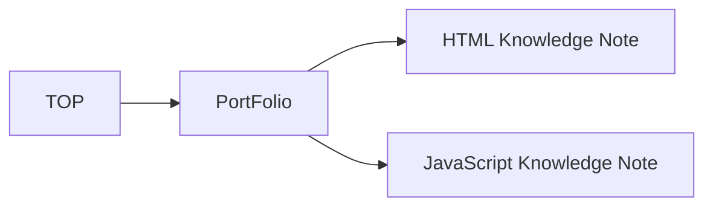

# README.md
## 当サイトについて
S.Kのプロフィール並びにポートフォリオの紹介サイトです。

## サイト要件
### 目的
S.Kのプロフィール、スキル、ポートフォリオ、キャリアを知ってもらうために制作しました。

### 対象ユーザー
- S.Kについて知りたい人。
- ポートフォリオサイトを作りたいと考えていて参考にしたい人。
- 個人でのWebサイト制作の参考にしたい人。

## 設計
### 機能要件
- 対象デバイス
  -  ラップトップ
  -  スマートフォン
  -  タブレット

### 非機能要件
- レスポンシブ方針

|機種|ブレークポイント|
|-----|-----|
|スマートフォン| 1280px以内|
|タブレット| 500px以内|

### 制約・前提条件
- GitHub Pagesを使用するため、バックエンドに関わる動作はできない。
  - そのためヘッダー、フッターはJavaScriptを使用し共通部品とする。

### ブランチ
- main
  - 本番用ブランチです。URL(https://portfoliobysk.github.io)にアクセスした場合、こちらが表示されます。個別にファイルをご覧になる際はこちらからどうぞ。
- develop
  - 開発用ブランチです。mainブランチのファイルをご覧ください。

### フォルダ構成
- docs：ページ制作時の設計書、ワイヤーフレーム、モックアップを置いています。
- images：サイトで使用される画像を置いています。
- portfolio：ポートフォリオ作品のページを置いています。
- scripts：スクリプトファイル（JavaScript、TypeScript）を置いてます。
- styles：CSSファイルをまとめています。
  - base：全てのページのベースとなるCSSファイルを置いています。
  - components：例えばカードスタイルなど、共通部品として利用するCSSファイルを置いてます。
  - layout：ヘッダー、フッターなど共通部品として使えるレイアウト用のCSSファイルを置いています。
  - pages：特有のレイアウトや装飾が必要なページのCSSファイルを置いています。

### サイトマップ

### 詳細サイトマップ
|ID|ページ名|概要|
|-----|-----|-----|
|000|TOP   |このサイトの概要とプロフィール、スキル、ポートフォリオ、キャリアをまとめました。|
|010|Porfolio|ポートフォリオの一覧ページになります。|
|011|HTML Knowledge Notes|HTML学習のポイントやメモをまとめました。|
|012|JavaScript Knoeledge Notes|JavaScript学習のポイントやメモをまとめました。|

# Lisence
This project is licensed under the MIT License, see the LICENSE file for details
