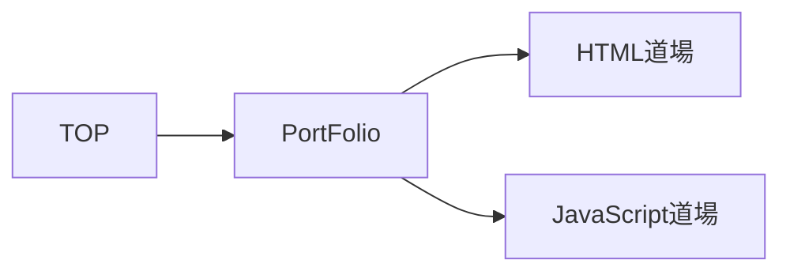

# 当サイトについて
S.Kのプロフィール並びにポートフォリオサイトになります。

# 要件定義
## 当サイトの目的
S.Kの経歴、スキルを知ってもらうために制作しました。

## 対象ユーザー
- S.Kについて知りたい人。
- ポートフォリオサイトを作りたいと考えていて参考にしたい人。
- 個人でのWebサイト制作の参考にしたい人。

## 各ブランチの説明
- main
  - リリース用ブランチです。こちらをご覧ください。
- develop
  - 開発用ブランチです。mainブランチのファイルをご覧ください。

# 設計
## サイトマップ

## 詳細サイトマップ
|ページ名|コンテンツ|概要|
|------|-----|-----|
|TOP     |About    |このサイトの概要。
|        |Profile  |自己紹介、スキル、学習に利用したサイトや書籍の紹介。
|        |PortFolio|作品の一覧。
|HTML道場|          |   |
|JavaScript道場|    |   |

## ワイヤーフレーム
### Topページ

## モックアップ
鋭意制作中

# Lisence
This project is licensed under the MIT License, see the LICENSE file for details
