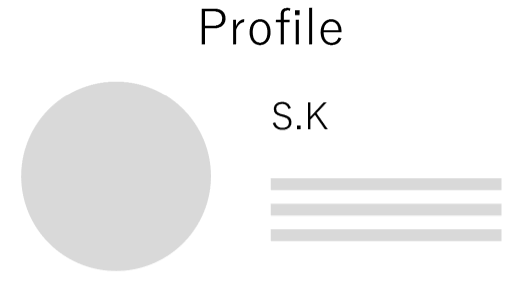
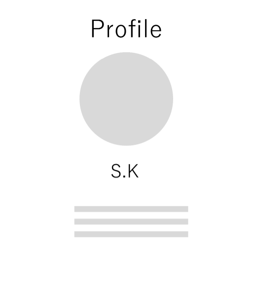
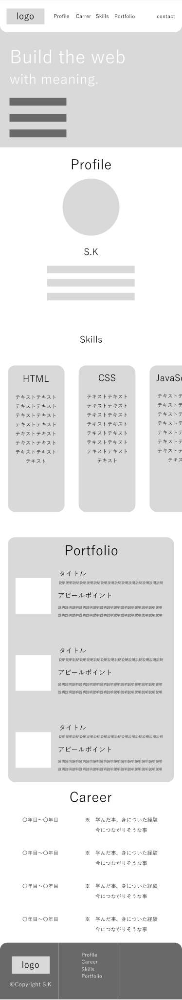

# 000_DesignNote.md

 | 更新日 | 変更履歴 |
 |------- | -------|
 |2025/12/29|初版|

## 要件定義
### 概要
トップページ制作にあたって必要な要件と設計を定義したドキュメントである。

### 背景・目的
TOPページはポートフォリオサイトにおいて、訪問者が一番最初に訪れるページなのでコンセプトを分かりやすく伝えたい。その為、親しみやすくするため角丸を多用し、やさしさを伝える。

## 設計
### コンテンツ設計
- Hero
  - サイトの概要とイメージを掲載する。
- Profile
  - 顔イメージ、名前、人物概要を掲載。
  - Skills
    - カード形式で横スクロールさせることで興味を引く。
- Portfolio
- Carrer

### ワイヤーフレーム
#### PC版

- Profileセクションについて、当初No1で制作しようとしていたが、視線移動が複雑なためNo2に途中から修正。

|N01|No2|
|-----|-----|
|||

#### タブレット版

- PC版のCSSのままChromeのDeveloperツールで確認すると、画面が拡大されることによりposition: fixed;に指定した要素がズレ、固定されないことがあるので注意。

#### スマートフォン版

### モックアップ
#### PC版

#### タブレット版

#### スマートフォン版